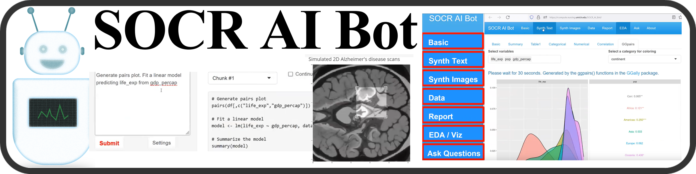

# SOCR 2D Brain Image and 3D Volume Data Generator

## Overview 
The [SOCR 2D/3D Brain Data AI Generator (RShiny App)](https://rcompute.nursing.umich.edu/SOCR_ImgGenApp/) provide interactive AI service for synethic generaiton of realistic 2D brain images and 3D Brain volumes.

See the [DSPA2 GAIM Documentaiton](https://socr.umich.edu/DSPA2/DSPA2_notes/DSPA_Appendix_11_Foundational_Generative_AI_Models_GAIMs.html).

## Team

[SOCR Team](https://www.socr.umich.edu/people/) including [Ivo D. Dinov](https://umich.edu/~dinov), Achu Shankar, Simeone Marino, Ryan Kwon, and others.

## Code Structure

The code is organized as follows:
- `ui.R` and `server.R` are the main files for the RShiny app.
- `global.R` contains the global variables and functions.
- `dataset.R` contains the initialization and pre-processing of the dataset.
- ...
- 
Other files are mostly for testing and debugging and less important.

## Guidelines for Future Development
- Using RStudio is the easiest way to develop and the app almost out-of-box. However, if you want to use other IDEs like VSCode, use `renv` to manage the packages. The `renv.lock` file is already included in the repo. To install the packages, run `renv::restore()` in the R console. You may need to install other dependencies manually to install the packages, if there's error message saying so.

## Acknowledgments

This work is supported in part by NIH grants [P20 NR015331](www.socr.umich.edu/CSCD), [UL1TR002240](https://projectreporter.nih.gov/project_info_description.cfm?aid=9491961&icde=39078316), [P30 DK089503](http://mmoc.med.umich.edu/), [UL1TR002240](https://www.michr.umich.edu), and NSF grants [1916425](http://midas.umich.edu/), [1734853](http://brain-life.org/), [1636840](http://neurosciencenetwork.org/), [1416953](http://distributome.org), [0716055](http://socr.umich.edu) and [1023115](http://distributome.org). Students, trainees, scholars, and researchers from SOCR, BDDS, MIDAS, MICHR, and the broad R-statistical computing community have contributed ideas, code, and support.

## References

* [SOCR Publications](https://www.socr.umich.edu/people/dinov/publications.html).
* [DSPA2 GAIM Documentaiton](https://socr.umich.edu/DSPA2/DSPA2_notes/DSPA_Appendix_11_Foundational_Generative_AI_Models_GAIMs.html).
* [SOCR 2D/3D Brain Data AI Generator (RShiny App)](https://rcompute.nursing.umich.edu/SOCR_ImgGenApp/).

